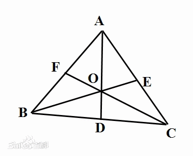

# ACM 五道题题解

[HDOJ 题目页面](http://acm.hdu.edu.cn/diy/contest_show.php?cid=35598)

密码 : **sybzx**

---

## Author List

- Java via **Sonder Lau**
- Cpp via **Ablerich**
- C via **张晗**

---

### D1001

- 题目阐述明确 ans 即为 O-R-Z 按照顺序的组合个数 包括但不限于之间有间隔
- 查看 Problem Description 代码是符合题目要求的
- 在上方可以看到
- `Time Limit : 1000/1000ms (Java/Other) Memory Limit : 65535/32768K (Java/Other)`
- 代码案例中使用了 3 层 for 循环 时间复杂度 O(N3) 尝试提交 超时
- 方向：减少嵌套的循环 减少运行的时间
- 思路：根据例子思路 只需要判断每个 R 的前后各有多少个 O 或者 Z 再全部加起来即可 因此需要将
  - 找到每个 R 确定位置
  - 每个 R 前面有多少个 O
  - 每个 R 后面有多少个 Z
- 三个过程分开进行处理 可以采用三个平行关系的循环
  - 找 O / Z
  - for 从前/后面往前面进行循环 同时先进行值得递归操作 如果符合条件 在赋值过来得值上面+1 目的是得到得当前位置的数字是前/后面数字的总个数 存入数组
  - 再通过 for 循环找到每一个 R 通过数组调用 2 个存储个数的数组 再全部加起来等于答案
- 细节
  - String 输入后总长度不超过 100000 可以通过 新建一个**长度为 100010**的字符串减少运算和储存量
  - 考虑字符的加和问题 int 类型不够用 因此存储使用 long 类型的数组和变量
  - `input.close()`
- **Total Submission(s) : 650 Accepted Submission(s) : 61**
- AC 率 **9.384 %**
- 参考解法

**Java**

```java
  package ACM;

  import java.util.Scanner;

  public class D1001 {
      public static void main(String[] args) {
          long ans = 0;
          Scanner kb = new Scanner(System.in);
          String str = kb.next();
          int strLength = str.length();
          long[] Onum = new long[100010];
          long[] Znum = new long[100010];
          for (int i = strLength-1; i >= 0; i--) {
              Znum[i] = Znum[i+1];
              if(str.charAt(i) ** 'Z'){
                  Znum[i]++;
              }
          }
          if (str.charAt(0) ** 'O'){
              Onum[0] = 1;
          }
          for (int j=1; j<= strLength-1;j++){
              Onum[j] = Onum[j-1];
              if (str.charAt(j) ** 'O'){
                  Onum[j]++;
              }
          }
          for (int k=1;k < strLength-1;k++){
              if (str.charAt(k) ** 'R') {
                  ans += (Onum[k] * Znum[k]);
              }
          }
          System.out.println(ans);
          kb.close();
      }
  }
```

**C**

```c
 #include <stdio.h>
    #include <string.h>
    int main()
    {
        char a[100010];
        scanf("%s", a);
        long long b1=0, b2=0, b3=0;
        int len = strlen(a);
        for (int i = 0; i < len; i++)
        {
            if (a[i] ** 'O')
                b1++;
            else if (a[i] ** 'R')
                b2 += b1;
            else if(a[i]**'Z')
                b3 += b2;
        }
        printf("%lld\n", b3);
        return 0;
    }
```

**Cpp**

```cpp
#include<iostream>
#include<string>
#include<cstring>
#include<cstdio>
#define _for(i,a,b) for(int i=a;i<b;i++)
#define LL long long
using namespace std;
int main()
{
    string a;
    cin>>a;
    LL o,r,z;
    LL ans=0;
    o=r=z=0;
    _for(i,0,a.length())
    {
    if(a[i]**'Z'){z++;}
    }
    _for(i,0,a.length())
    {
        if(a[i]**'O'){o++;}
        if(a[i]**'R'){ans+=o*z;}
        if(a[i]**'Z')z--;
    }
    cout<<ans<<endl;
    return 0;
}
```

---

### D1002

- 根据题目阐述 输入 N 组数据 每组包含 a b 各一个 输出 2 者的和

- 整体来看难度不大 没有时间和内存限制

- 细节 :

  - **(0<=a, b<=2^31^-1)**

  - a b 的值有一定的范围 查阅资料得

  - > -2^31^到 2^31^-1 占用四个字节

- 而本题 ab 数值恰好符合 容易产生在范围的思考误区

- **没有考虑到 2 者加和后得值是否还在 int 区间内**

  - 考点 `int short long float double` 的取值范围

- **Total Submission(s) : 879 Accepted Submission(s) : 114**

- AC 率 12.969%\*\*

- 参考答案

**Java**

```java
  package ACM;

  import java.util.Scanner;

  public class D1002 {
      public static void main(String[] args) {
          Scanner sc = new Scanner(System.in);
          while (sc.hasNextLong()){
              long a  = sc.nextInt();
              long b = sc.nextInt();
              System.out.println(a+b);
          }
          sc.close();
      }
  }
```

**C**

```c
 #include<stdio.h>
    int main()
    {
        double a, b;
        while((scanf("%lf%lf", &a, &b)) != EOF)
        {
            printf("%.lf\n", a + b);
        }
        return 0;
    }
```

**Cpp**

```cpp
#include<iostream>
#include<cstring>
#include<algorithm>
#include<string>
#include<cstdio>
#include<vector>
#include<map>
#define _for(i,a,b) for(int i=a;i<b;i++)
#define LL long long
using namespace std;
LL measure(LL x,LL y);
int main()
{
LL s1,s2,s3,T;
cin>>T;
_for(i,0,T)
{
    cin>>s1>>s2>>s3;
    LL ans1=s1*s2*s3*s3*2+s1*s2*s2*s3+s1*s1*s2*s3;
    LL ans2=s3*s3*s3-s1*s2*s3;
    //cout<<"1:"<<ans1<<" 2:"<<ans2<<endl;
    if(ans1<0 or ans2<=0){cout<<"-1"<<endl;continue;}
    LL t=measure(ans1,ans2);
    ans1/=t;ans2/=t;
    ans1+=ans2*(s1+s2+s3);
    cout<<ans1<<" "<<ans2<<endl;
}
return 0;
}
LL measure(LL x,LL y)
{
    LL temp=y;
    while(x%y!=0)
    {
        temp=x%y;
        x=y;
        y=temp;
    }
    return temp;
}
```

---

### D1003

- 题目描述较为复杂 涉及到多种饮料的名字 容易混淆思路

- 其问题转换后可等价于 m k 的最小公倍数能整除多少次 n

- 思路 :

- 参考文章

  - [2 种方法总结](https://hziee.site/pages/MISC/ExperimentalClassAnalysisOfTheQuestions/link1) [参考文章 1](https://hziee.site/pages/MISC/ExperimentalClassAnalysisOfTheQuestions/link2) [参考文章 2](https://hziee.site/pages/MISC/ExperimentalClassAnalysisOfTheQuestions/link3)

  > #### 辗转相除法
  >
  > 又称**“欧几里得算法”** 是求最大公约数的算法
  >
  > **求两个数的最大公约数**：
  >
  > 如果 m > n,令余数 remainder = m%n,
  >
  > 如果余数不为 0,则令 m = n, n = remainder,
  >
  > 再次 remainder = m%n,直到 remainder = 0,此时 n 就是最大公约数
  >
  >
  > #### 短除算法
  >
  > 两个数相乘等于这两个数的最大公约数和最小公倍数的积

- 最大公因数 参考答案

-

```java

  private static long gcd(long x, long y) {
         return  y != 0 ? gcd(y, x % y) : x;
      }
```

- 采用了递归的方法 即可得到最大公因数

- 最小公倍数由以上易得

- 细节:

  - **`每行包含三个数n,m,k（1<=n,m,k<=1e9)`** 数值范围会超过 int 的范围 因此采用 long 类型

- **Total Submission(s) : 717 Accepted Submission(s) : 89**

- AC 率 **12.413%**

- 参考解法

**Java**

```java
  package ACM;

  import java.util.Scanner;

  public class D1003 {
      public static void main(String[] args) {
          long max,min;
          Scanner sc = new Scanner(System.in);
          int rounds = sc.nextInt();
          while (rounds >0){
              long n = sc.nextInt();
              long m = sc.nextInt();
              long k = sc.nextInt();
              long temp = m*k;
              if (m>k){
                  max=m;
                  min=k;
              }else {
                  max=k;
                  min=m;
              }
              temp /= gcd(max ,min);
              System.out.println(n/temp);
              rounds--;
          }
          sc.close();
      }
      private static long gcd(long x, long y) {

         return  y != 0 ? gcd(y, x % y) : x;
      }
  }

```

**C**

```c
#include <stdio.h>
    int main()
    {
        int n, m, k, T, temp, flag = 0;
        scanf("%d", &T);
        while (T--)
        {
            flag = 0;
            scanf("%d%d%d", &n, &m, &k);
            temp = n % m;
            n = n - temp;
            for (int i = 1; i <= n / m; ++i)
            {
                if (i * m % k **0)
                {
                    flag++;
                }
                else
                {

                }
            }
            printf("%d\n", flag);
        }
        return 0;
    }
```

**Cpp**

```cpp
#include<iostream>
#define _for(i,a,b) for(int i=a;i<b;i++)
using namespace std;
void pro( long long j,long long k,long long l);
//long long measure(long long a,long long b);
int main()
{
int T;
long long a,b,c;
cin>>T;
_for(i,0,T)
{
cin>>a>>b>>c;
pro(a,b,c);
cout<<endl;
}
return 0;
}
long long measure(long long x,long long y)
{   long long z = y;
    while(x%y!=0)
    {
        z = x%y;
        x = y;
        y = z;
    }
    return z;
}
void pro( long long j,long long k,long long l)
{   if(l>j or k>j){cout<<"0";return;}
    long long gdc=measure(k,l);
    long long gcd=k/gdc*l;
    if(gcd>j){cout<<"0";return;}
    j=j/gcd;
    cout<<j;
    return;
}
```

---

### D1004

- 本题结合当下军训现实 贴近真实生活

- T 组数据

- 每行包含三个整数 n m q 每行一个整数 ki

- 思路：

  - 本题原题目为 **约瑟夫环问题**

  - 参考百度百科 [百度百科 约瑟夫问题](https://hziee.site/pages/MISC/ExperimentalClassAnalysisOfTheQuestions/Joseph)

  - 知乎上有此问题 Java 的详细解法 [知乎文章](https://hziee.site/pages/MISC/ExperimentalClassAnalysisOfTheQuestions/zhihu)

  - 我最近也在微信公众号上找到了该问题的不错解答 [五分钟学算法](https://hziee.site/pages/MISC/ExperimentalClassAnalysisOfTheQuestions/weixin)

  - 其甚至给出了一行解决的代码

  -

````java

    int f(int n, int m){
        return n ** 1 ? n : (f(n - 1, m) + m - 1) % n + 1;
    }
```

  + 确实很巧妙的解法 但并不适用于本题 因为其题目都是求最后一个活下来的是谁 而本题要求出第几个出去的问题

  + 可以尝试使用数组或者是环形链表 每次出局的人进行移除处理 通过变量自增 若满足情况即输出即可

* 细节:

  + 输入的值很少 `int` 够用
  + 输出有规定的格式
    - Case #Ti：
      - 冒号是全角冒号
    - 每个 Case 之间有空行 **但是最后一个没有**

* **Total Submission(s) : 362 Accepted Submission(s) : 45**

* AC 率 **12.431%**

* 参考解法

**Java**

``` java
  package ACM;

  import java.util.ArrayList;
  import java.util.Scanner;

  public class D1004 {

          public static void main(String[] args) {
              Scanner sc = new Scanner(System.in);
              int rounds = sc.nextInt(); // 几组数据
              for (int temp = 1;temp<=rounds;temp++){
                  System.out.println("Case #"+ temp+":");

                  int total = sc.nextInt(); // 总人数
                  int count = sc.nextInt(); // 数到几
                  int times = sc.nextInt(); // 询问几次
                   // Case #
                      for (int temp1 = 0;temp1<times;temp1++){
                          int num = sc.nextInt(); // 第几个出来
                          joseph(total,count,num);
                      }

                  if (temp <rounds){
                      System.out.println();
                  }

              }
              sc.close();
          }

          /**
           * @param total 总人数
           * @param count 数到几出列
           * @param  num 想要得到第几个
           */
          // joseph 方法
          private static void joseph(int total, int count, int num) {

              ArrayList<String> list = new ArrayList<String>(); // 人 数组
              int startIndex = 0; // 从第一个 也就是数组的第0个
              int countActual = count - 1; // 每隔几个到加几个
              for (int i =1;i <= total;i++){
                  list.add("" + i);
              }
              int numTemp = 0;
              while (list.size() > 0) {
                  startIndex = (startIndex + countActual) % list.size();

                  if ((numTemp + 1) ** num){
                      System.out.println(list.get(startIndex));
                  }

                  list.remove(startIndex);
                  numTemp++;
              }
          }
      }
````

**C**

```c
#include <stdio.h>
#define N 50
#define MAX 50
    int main()
    {
        int a[N], m, n, x, i, count = 0, T, b[N], no = 0, who, num = 0, which, myprint;
        scanf("%d", &T);
        while (T--)
        {
            no = 0;
            myprint = 1;
            scanf("%d%d", &n, &m);
            x = n;
            for (i = 1; i <= n; i++)
            {
                a[i] = i;
            }
            do
            {
                for (i = 1; i <= n; i++)
                {
                    if (a[i] != 0)
                        count++;

                    if (count ** m)
                    {
                        a[i] = 0;
                        count = 0;
                        x--;
                        b[++no] = i;
                    }
                }
            } while (x > 0);
            scanf("%d", &who);
            while (who--)
            {
                scanf("%d", &which);
                if (myprint ** 1)
                {
                    printf("Case #");
                    printf("%d:\n", ++num);
                    myprint--;
                }
                printf("%d\n", b[which]);
            }
            if(T!=0){
                printf("\n");
            }

        }
        return 0;
    }
```

**Cpp **

```cpp
#include<iostream>
#include<algorithm>
#include<cstring>
#include<cstdio>
#define _for(i,a,b) for(int i=a;i<b;i++)
using namespace std;
int main()
{
int T,cnt;
int a[100],b[100],c[100],d[100],e[100];
int m,n,q;//n:total student  m:rbq  q:q questions
cin>>T;
_for(i,0,T)
{
int cnt=1;//calc
int an=0;
cin>>n>>m>>q;
_for(j,0,q)cin>>e[j];
_for(j,0,n)
{
a[j]=j;	b[j]=j+1;d[j]=j-1;
}
b[n-1]=0;d[0]=n-1;int temp=0;
while(n>0)
{
    if(cnt**m){b[a[d[temp]]]=a[b[temp]];
    d[a[b[temp]]]=a[d[temp]];c[an]=temp+1;an++;cnt=0;n--;}
    temp=b[temp];cnt++;
}
cout<<"Case #"<<i+1<<":"<<endl;
_for(j,0,q)cout<<c[e[j]-1]<<endl;
if(i!=T-1)cout<<endl;
memset(a,0,sizeof(a));
memset(b,0,sizeof(b));
memset(c,0,sizeof(c));
memset(d,0,sizeof(d));
}
return 0;
}
```

---

### D1005

- 本题结合目前信工施工实况 贴近生活 真实

- 其本质为一道数学题目 并无编程相关的难度

- 参考 [燕尾定理](https://bkso.baidu.com/item/燕尾定理/10828082)

-



- > 燕尾定理：在三角形 ABC 中,AD,BE,CF 相交于同一点 O,有

  > S△AOB∶S△AOC=BD∶CD
  >
  > S△AOB∶S△COB=AE∶CE
  >
  > S△BOC∶S△AOC=BF∶AF
  >
  > 因此图类似燕尾而得名。是五大模型之一,是一个关于平面三角形的定理,俗称燕尾定理。
  >
  >
  > 燕尾定理由英国数学家亚马力斯·凯诺(1753-1821)(Yanmalice·Kanon)于 1785 年发现

- **以下数学计算式子较多 头疼预警**

- 思路：

  - 通过 x y z 得到总面积的表达式
  - $S_{\triangle}FOB = x \quad S_{\triangle}BOC = y \quad S_{\triangle}EOC = z$
  - 写出三个燕尾定理表达式
  - $\frac{z}{y+S_\triangle AOE} = \frac{x}{S_\triangle AOF} = \frac{BF}{AF}$
  - $\frac{S_\triangle AOF + x} {S_\triangle AOC} = \frac{S_\triangle BOD}{S_\triangle ODC} = \frac{BD}{DC}$
  - $\frac{x + S_\triangle AOF}{z} = \frac{S_\triangle AOE}{y} = \frac{AE}{EC}$
    - 联立各个表达式可得到最后的总面积表达式
    - S 总 = $\frac{(x+y) \times (zy + z^2)}{z^2 - xy}$

- 得到了分子和分母 但是得到的并不是最终的结果 还需要化简

  - 化简很简单 利用上面题目所写的求最大公因数 两个数除以即可得到最终答案

- 细节

  - int 不够用
  - 判断是否合法
    - 分子是加乘的形式 只需要判断分母是否小于等于 0 即可

- **Total Submission(s) : 412 Accepted Submission(s) : 67**

- AC 率 **16.262%**

- 参考解法

**Java**

```java
  package ACM;

  import java.util.Scanner;

  public class D1005 {
      public static void main(String[] args) {
          Scanner sc = new Scanner(System.in);
          int rounds = sc.nextInt(); // 几组数据
          for (int i = 1; i <= rounds; i++) {
              long x = sc.nextLong();
              long y = sc.nextLong();
              long z = sc.nextLong();
              long molecule = (x + z) * (z * y + z * z);
              long denominator = z * z - x * y;
              if (denominator <= 0) {
                  System.out.println("-1");
              } else {
                  long gCD = gcd(molecule,denominator);
                  molecule /= gCD;
                  denominator /= gCD;
                  System.out.println(molecule + " " + denominator);
              }

          }

          sc.close();
      }
      private static long gcd(long x, long y) {

          return y != 0 ? gcd(y, x % y) : x;
      }

  }
```

**C**

```c
 #include <stdio.h>
    int main()
    {
        long T, X, Y, Z, LFZ = 0, RFZ = 0, FM = 0, OTHER = 0, YF, FZ;
        scanf("%d", &T);
        while (T--)
        {
            scanf("%d%d%d", &X, &Y, &Z);
            LFZ = X * X * Y + X * Y * Z;
            RFZ = X * Y * Y + X * Y * Z;
            FM = Z * Z - X * Y;
            OTHER = FM * X + FM * Y + FM * Z;
            if (FM <= 0)
                printf("-1\n");
            else
            {
                YF = FM;
                FZ = LFZ + RFZ + OTHER;
                    for (int i = YF; i > 1; i--)
                    {
                        if (FM % i ** 0 && FZ % i ** 0)
                        {
                            FM = FM / i;
                            FZ = FZ / i;
                        }
                    }
                    printf("%ld ", FZ);
                    printf("%ld\n", FM);
            }
        }
    }
```

**Cpp**

```cpp
#include<iostream>
#include<cstring>
#include<algorithm>
#include<string>
#include<cstdio>
#include<vector>
#include<map>
#define _for(i,a,b) for(int i=a;i<b;i++)
#define LL long long
using namespace std;
LL measure(LL x,LL y);
int main()
{
LL s1,s2,s3,T;
cin>>T;
_for(i,0,T)
{
	cin>>s1>>s2>>s3;
	LL ans1=s1*s2*s3*s3*2+s1*s2*s2*s3+s1*s1*s2*s3;
	LL ans2=s3*s3*s3-s1*s2*s3;
	//cout<<"1:"<<ans1<<" 2:"<<ans2<<endl;
	if(ans1<0 or ans2<=0){cout<<"-1"<<endl;continue;}
	LL t=measure(ans1,ans2);
	ans1/=t;ans2/=t;
	ans1+=ans2*(s1+s2+s3);
	cout<<ans1<<" "<<ans2<<endl;
}
return 0;
}
LL measure(LL x,LL y)
{
	LL temp=y;
	while(x%y!=0)
	{
		temp=x%y;
		x=y;
		y=temp;
	}
	return temp;
}
```

---

### 感谢

**再次感谢以上三位提供的题解和思路**

**欢迎大家指正和讨论**
