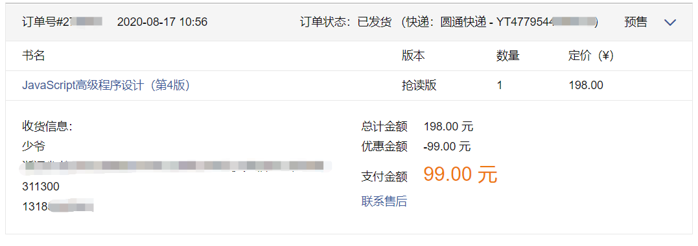
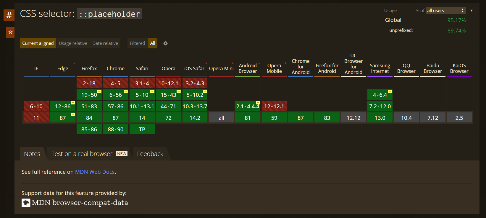
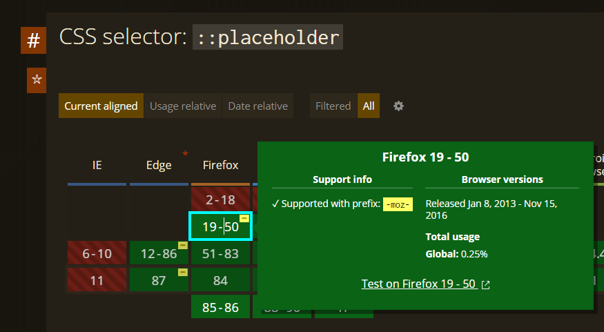
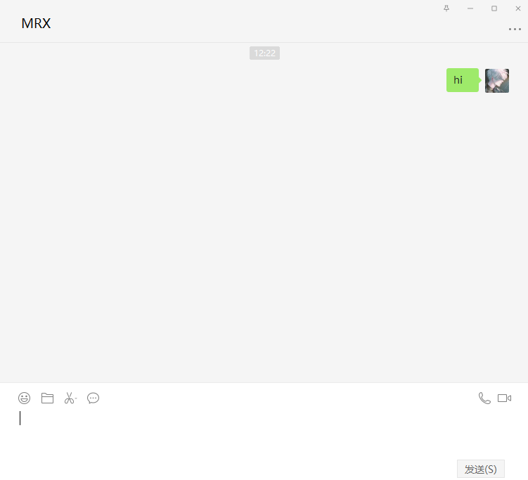
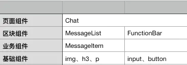
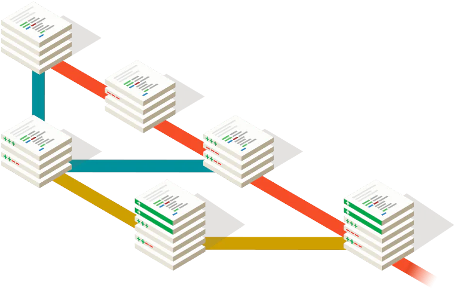

# ES6 与 前端工程化入门

Sonder Lau on 2021/1/15

## 前言

在开始之前我们先简单的通读一下标题，大概知道了今天我要分享两个东西 `ES6` 以及 `前端工程化` 

关于工程化后面会有更详细的介绍 我先就`ES6`部分向大家介绍下

`ES6`即 `ECMAScript 6` ，是`JS`语言的下一代标准，该标准于 2015年6月发布。

事实上该标准从制定到最后的发布，整整用了`15`年之久

### `ES JS` 之间的区别

最常见的问题就是大家分不太清楚`ES` `JS` 之间的区别

> 这个故事要从1996年的11月讲起，`JS`的创始者`Netscape`公司打算把这个语言交给标准化组织`ECMA`
>
> 希望这种语言能够成为国际标准
>
> 次年 `ECMA`发布了262号标准文件`ECMA-262`的第一版 
>
> 规定了浏览器脚本语言的标准并将这种语言称为 `ECMAScript` 这个版本就是`1.0`版本
>
> 该标准一开始就是针对`JavaScipt`指定的，但是之所以不叫作`JavaScript`是因为只有 Netscape 公司可以合法地使用 JavaScript 这个名字，且 JavaScript 本身也已经被 Netscape 公司注册为商标，而且`ECMA`更像体现这门语言的制定者是`ECMA`而不是`Netscape`公司，这样有利于保证这门语言的开放性和中立性


因此`ECMAScript` `JavaScript`的关系其实是

> 前者是后者的规格，后者是前者的一种实现

为什么说是一种呢 因为还有 `JScript` 和 `ActionScript`


### `ES6`与`ECMAScript 2015`的关系

2011年 `ECMAScript 5.1`版本发布后，就开始着手准备`6.0`版本了 因此`ES6`其实本意就指的是`5.1`之后的下一个版本

但是`6.0`版本的新语法功能太多，而且在制定的过程中，仍会有很多的公司和个人的新功能的提案

一般有这种问题的话都是先发布`6.0`后续发布`6.1` `6.2`等版本

但标准的制定者不打算这么做，他们想让每个人都可以在任何时候提交提案，每个月都可以有变动，但每年`6`月发布当年的标准版本，每年新增的内容就在上一年发布版本的基础上增加

这样以来就不用记忆版本号了，只需要记住年份就好了

因此`ES6`的第一个版本，就在`2015`年`6`月发布了

因此，ES6 既是一个历史名词，也是一个泛指，含义是 5.1 版以后的 JavaScript 的下一代标准，涵盖了 ES2015、ES2016、ES2017 等等

而 ES2015 则是正式名称，特指该年发布的正式版本的语言标准


---


如果不太好理解，那么大家就可以简单的认为是`ES6`多了许多新的语法

多到以至于，工程化里面有一部分的内容是要用到`ES6`新语法的

`ES6`的新语法非常多，阮一峰先生就出了一本 《ES6入门教程》，我刚刚做的简介大部分就是参考自这本书的内容

书是开源的，地址我放到了资源索引里面了，这本书同样也有纸质版

我自己也有一本，最新版是第三版，我认为讲的还是非常好的，有许多的例子。


---


`ES6`的介绍部分就这么多，因为我不打算讲一些语法之类的东西，在课上讲比较的枯燥

这部分就留给大家，有兴趣的可以自行去了解了。

同时后面的部分，也会穿插一点`ES6` 的部分，但是不理解语法不会影响大家的理解，所以不必担心


---

### 开讲前

今天我想讲的有趣一点，所以我打算以一种 **提出问题-解决问题-现有解答**

- 有什么样的问题
- 我们想实现怎么样的解决效果
- 目前比较成熟的解决方案

这种方式会方便大家能理解我的思路


在开始之前，我先向大家推荐两本书，对前端感兴趣的同学可以趁着寒假看起来

一本是被誉为红宝书的`JavaScript`高级程序设计 **第四版** 2020年9月第二次印刷的 差不多 10月份的时候才发布的

我有一本是预定版，我还没读完，但是发现了不少语句不通和一些错误了，推荐大家购买的时候看一下不要购买第二次和第一次印刷的版本

或者直接去购买正版电子书，有错误会及时的更新，官方勘误也会发布在上面

我当初预定是把电子版和纸质书都买了 

然后这里我把正版的电子书`pdf`文件分享给大家，

请勿传播，因为正版书籍里面有我的账号的水印，大家就自己用就好了。

> 


另外一本，其实是两本，叫做《CSS权威指南》第四版。

因为内容比较多，分为了上下两册，里面的内容读起来会没有那么的有趣，因为`CSS`这门语言本质上与`Java` `C` 语言等语言不同，学起来没有那么的有关联性，这本书大家也不要硬读，平时用到什么或者不懂了什么，翻翻查查就可以了，有个整体的了解就好了。


如果觉得购买纸质书籍比较贵，那么可以考虑以下的几本书，资源的链接地址都可以在我写的一份资源索引列表中找到

- 《CSS权威指南 第四版 非官方中文译本》
- 《现代 JavaScript 教程》
- 《JavaScript教程 - 阮一峰》

---

## 工程化 Engineering

从最开始的网页三剑客 `HTMl` + `CSS` + `JS` 编写网页，渐渐人们发现了这样做有很多的缺陷，特别需要更为可靠性、效率化开发的开发者，如企业等等。

最让人们第一个想到的问题就是，有一个需要在很多地方都用到的一个样式

比如以 `Bilibili` 主页上一个分区的推荐视频为例，这个页面上有很多分区，每个分区都是这样类似的一个布局，那么每个这样的分区推荐都是一个组件，而每个分区里面有推荐的视频封面标题作者等，每个不同视频之间也是可以抽象成一个组件，那这样分区中又包含了多个视频预览组件

倘若像之前开发一样，试想有许多重复的`div`嵌套`div`的`HTMl`代码，而这些重复的冗余代码会非常多，而他们之间就仅仅是数据的值不同，而数据的格式、显示的样式几乎完全一样。

> 

如此庞大的代码量放到了项目中，增加了项目的文件大小，却并没有增加多少的新功能。

因此我们想有一个比较优雅的解决方案，即使用类似 **模板** 一样的东西，简化我们对复用性很高的代码段的使用。

于是就有了我们把解决方案称作 模块化


### 模块化

但是在开始之前我要强调一点，模块化是一种设计思想，并不是前端领域独有的。


通俗的讲 就是讲一个整合性的文件拆分成互相依赖的多个文件，在开发时对不同的几个文件进行开发，但是最后发布时将多个文件按照依赖进行打包和整合。但在这一步，我们仅仅考虑如何设计分开的文件格式以及怎么设计让程序能读懂文件之间的依赖关系。

模块化的目的是保证高效的多人合作，只需要简单的知道依赖关系，仿佛有一种 **那部分的文件已经写好了，传给我的是什么，有什么样的格式，我需要返回什么样的东西，什么样的格式就好了** 这种感觉。 

这意味着 当我们在编写代码的时候 就不需要读太多**上下文** 代码段。特别是在多人持续开发的时候，其他人的工作量会减小很多。

上面提到的模块化，大家比较熟悉的如`Java`中的接口、类这种概念，但是`Class`类这个概念`JS`语言也是直到`ES6`才真正实现了出来，在这之前是没有这个概念的，

目前前端领域主要包含

#### `JS`模块化

##### `CommonJS`

- 由`Node.js`提出的一套标准，概况如下

- 一个文件就是一个模块 `Module`

- 每个模块都有单独的作用域

- 通过`module.exports`导出成员

- 通过`require`函数载入模块

- `CommonJS`是以同步(`Sync`)模式加载模块

- ```javascript
  // CommonJS
  var math = require('math');
  math.add(2,3);
  ```

- 但是这种写法是非常有局限性的，因为要知道`Node.js`在创立之初，是为了能够让`JS`编写类似服务端，也就是后端的效果。但是当我们执行了上述的`require()`语句后，必须等待`math.js`加载完成才能够继续的执行后面的代码，如果这个文件很复杂很庞大，那么就会让整个应用有一个停滞的时间

- 但是这对`Node.js` 来说并不是大问题，因为所有的模块都放在服务器中的硬盘上，等待的时间也就是硬盘读取时间，鉴于`js`文件还没有多少文件能够让硬盘读取出现卡顿，因此这个问题无关紧要

- 但是在浏览器端这就是个大问题了，浏览器需要下载这个`js`文件，之后进行读取，这样就很可能会产生卡顿。因此`Synchronous`同步化的加载方式在浏览器端就不适用了，于是我们想要一个异步的方式去加载

##### `AMD`

- 这个不是做`CPU` 的那个，全称是 `Asynchronous Module Definition`

- 这个做到了异步加载模块，也就是说，加载一个模块的快慢，并不影响后面的模块执行。

- 但是异步也会有缺点，即我们不知道什么时候才能加载完。`AMD`是这样做的

- ```javascript
  require([module], callback);
  ```

- 他会传入一个由模块组成的数组，以及一个回调函数，即加载完成之后执行的代码

- 我们把上述的代码改成异步风格的 就看起来像这样了

- ```javascript
  // define
  define('math',['base'], function(){
      function add(a, b){
          return a +b;
      }
      return {
          add: add
      }
  })
  
  // load
  require(['math'], function(math){
      math.add(2, 3);
  })
  ```

- 有2个比较知名的库实现了该方式 `require.js` `curl.js` 后者停更挺久的了

天下太平久矣，必有异教徒也。

##### `CMD`

- 与`AMD`类似 其全程为 `Common Module Definition` 通用模块化定义
- `AMD`推崇 依赖前置，在定义模块的时候有需要声明其依赖的模块
- 而`CMD`不同，他推崇就近依赖，即用到什么才引入什么
- 两者各有优劣，区别只是对依赖的执行时机不同，注意这里我提到的是 执行时机，不是加载时机和方式
- 这两者都是异步的，且都是在执行之前就加载好了的
- `AMD`在加载模块完成后就会执行改模块，所有模块都加载执行完后会进入require的回调函数，执行主逻辑，这样的效果就是依赖模块的执行顺序和书写顺序不一定一致，看网络速度，哪个先下载下来，哪个先执行，但是主逻辑一定在所有依赖加载完成后才执行
- `CMD`加载完某个依赖模块后并不执行，只是下载而已，在所有依赖模块加载完成后进入主逻辑，遇到require语句的时候才执行对应的模块，这样模块的执行顺序和书写顺序是完全一致的

比较流行的实现了`CMD`的库有`Sea.js`

```javascript
// define
define(function(require, exports, module){
   		function add(a, b){
    		return a+b;
	}
	exports.add = add;
})

// load
seajs.use(['math,js'], function(math){
    var sum = math.add(1+2);
})
```


很多人对这两者的评价为 **AMD用户体验好，因为没有延迟，依赖模块提前执行了。CMD性能好，因为只有用户需要的时候才执行**


然而，非官方的自然不如原生的可靠

##### `ES6 Module`

- 上面讲的都是第三方提出的一些加载模块的概念和原理并用自己的方式实现了
- 下面讲的就是原生支持的模块依赖的加载方式
- 需要注意的是 `ES6 Module`不是对象的形式，在编译时就会引入模块代码，而不是运行时加载。


```javascript
// define math.js
var basicNum = 0;
var add = function(a, b){
    return a + b;
}
export {basicNum, add};

// load
import {basicNum, add} from './math';
add(basicNum,2);
```


#### `CSS`模块化

- 目前比较成熟的解析和语法 `Sass` `Less` `Stylus` `PostCSS` 等


##### 原生 CSS

> 首先我们先来看一下CSS最原始的用法
>
> - `style`标签书写
>
>   - ```html
>     <head>
>         <style>
>             div {
>                 margin: 20px;
>             }
>         </style>
>     </head>
>     ```
>
> - `style`书写
>
>   - ```html
>     <div style="marign:20px">
>        <!-- something here --> 
>     </div>
>     ```
>
> - `link`外部文件链接
>
>   - ```html
>     <link href="./main.css" rel="stylesheet" >
>     ```
>
> - `@import`导入
>
>   - ```css
>     @import url(common.css) all;
>     ```
>
> 在座的各位也刚完成了 网页课的期末大作业 不知道大家在设计 `CSS` 样式的时候有什么问题呢
>
> 常见的几大问题如下
>
> - 使用行内样式
>   - 样式不能复用
>   - 权重太高 不好覆盖
>   - 表现层与结构层没有分离
>   - 不能缓存，加载效率低
> - 使用导入样式
>   - 导入样式必须放在`style`标签的第一行，否则无效
>   - `@import`的语法方式并不能充分利用好浏览器的并发请求，该加载行为很可能会被延后出发或者被其他资源挂起
>   - 由于其加载延后，页面可能会有闪烁的现象

##### 预处理器 `Sass`/`Less`

- 解决的问题

  - 不支持变量
  - 不支持嵌套
  - 不支持父选择器

- 解决效果

  - 书写上更方便，但是编译之后仍然是原生

- ```less
  // variable
  @width: 10px;
  @height: @width + 10px;
  
  #header{
      width: @width;
      height: @height;
  }
  // nesting
  #header {
      .navigation {
          font-size:12px;
      }
      .logo {
          width: 300px;
      }
      // father selector
      &:nth-chiled(2) {
          margin: 20px;
      }
  }
  ```

##### 后处理器 `PostCSS`

- 与前两者不同的时，他使用的了`Abstract Syntax Tree` 抽象语法树的形式分析源码，并提供API可以用于修改内容 使用最广泛的如 `Autoprefixer`

  - 因为各个浏览器之间实现的`CSS`的解析不同，有一些功能可能有的浏览器实现了，但是仍处于实验阶段或其他原因，具体可以到 `Can I use` 网站上搜索

  - 举个例子，比如我想修改占位文本的样式

  - ```html
    <input placeholder="我应该是红色的！">
    ```

  - ```css
    input::placeholder {
      color: grey;
    }
    ```
    
  - 

  - 

  - 可以看到在火狐浏览器早些版本的实验性实现上是要有前缀才能够生效的

  - 因此我们像上面一个书写就会在这个版本上不能够生效

  - 而`Autoprefixer`就能够帮我们解决该问题，输入同样的代码之后，他会自动帮我们编译成

```css
input:-moz-placeholder {
	color: gray;
}
input:-ms-input-placeholder {
	color: gray;
}
input::placeholder {
	color: gray;
}
```

- 这仅仅是其中一个小功能，事实上`PostCSS`利用插件可以实现很多功能，并且他还支持`Less`/`Sass`等前置处理器


#### 资源模块化

- 任何资源都能够以 **模块** 的形式进行加载，
- 目前 图片/文件 等都能够通过 JS 做统一的依赖关系处理
- 代码之间的依赖都能够实现了，这种静态的文件的链接相对就简单很多了


### 组件化

与模块化不同之处在于，组件化是对`UI`层面的拆分

引用自`Vue.js`官方


通俗的说，前端组件化就是为了代码复用，提高研发效率

我们在设计组件的时候难免要思考两个问题


#### 拆分

- 需要对拆分时的考虑做不同程度的考量,最主要的是 **细粒度** **通用性** 
- 比如网页端的微信
- 
- 我们可以分四步进行拆分，类似于数学中的点线面体的概念
  - 基础组件：指`input`、`button`这种基础标签，以及其他UI框架等封装过的通用UI组件
  - 业务组件：由基础组件组合成的业务抽象化UI
  - 区块组件：由基础组件组件和业务组件组合成的UI块
  - 页面组件：展示给用户的最终页面
- 
- 这样就简单的拆分完了，然而我们还没有考虑`JS`部分的逻辑

#### 组合

- 渐进式 : 数据逐层传递，组件各自负责自己的业务逻辑

- 离散式 : 数据统一处理，集中处理业务逻辑

- 事实上这两种方式都在`Vue.js` `React.js`中应用的非常广泛

  - `Vue.js`声称自己是 渐进式的框架 其中的 `v-model`数据双向绑定机制很容易处理组件的上下级之间的数据，非常适合渐进式

  - `React.js`提倡使用函数式编程，并不完全双向绑定，通常需要`onChange`事件更新父级的`state`来更新`view`，因此其更适合离散式的组合方式

  - 上面的例子就是渐进式的方式，其优缺点也很明显了。优点即组件的职责划分非常清晰，缺点就是非直接相连的组件之间的通信不够方便也不够灵活

  - 离散式的写一下上面的例子

    - `MessageList`

      ```html
      <ul>
          {this.props.children}
      </ul>
      ```

    - `Chat`

      ```html
      <main>
      	<MessageList>
              messages.map(message => <MessageItem message={message} /> )
          </MessageList>
          <FunctionBar />
      </main>
      ```

      

**高内聚低耦合** 始终是软件设计的核心思想


### 规范化

开发前期以及开发期间指定的一系列规范,使项目能够进行良好的开发管理.

#### 目录结构

- `api` `views` `components` 

#### 编码规范

- 由于 `JS` 是弱类型的语言，通常代码的风格和逻辑变化程度会非常大，一般会用一些库对代码风格进行约束
- 常见有 `ESLint` `StyleLint`等

#### 文件命名规范

#### 样式管理规范

- `BEM` `Sass` `Stylus` `CSS Modules`

- `BEM`是一种`CSS`中`class`的命名方式

  - `Block Element Modifier`

  - ```html
    <div class="menu">
      <div class="menu__header">
        <h2 class="menu__title">Title text here</h2>
      </div>
      <div class="menu__body">
        
        <p class="menu__text">text</p>
        <p class="menu__text">
          <a href="test.html" class="menu__link">link</a>
        </p>
      </div>
    </div>
    ```

    

#### `git flow` 工作流规范

- 
- 分支命名规范
- 代码合并规范等
- 由于`git`并不是今天这节课的主线内容因此我把这部分的介绍网页放给了大家 请大家查阅 **计算机教育中缺失的一课**

#### 定期的 `code review` 代码审查

- 是指对计算机源代码系统化地审查，常用软件同行评审的方式进行，
- 其目的是在找出及修正在软件开发初期未发现的错误，提升软件质量及开发者的技术
- 代码审查常以不同的形式进行，例如结对编程、非正式的看过整个代码，或是正式的软件检查


### 自动化

以上的模块化、组件化虽然简化了人开发的难度和理解程度，但是这样的形式是不能够被机器或者说是程序认可的

那么就需要进行所谓的整合

前面提到了，组件化和模块化会使得资源的分布会不那么统一，这时候就需要一个工具，能够帮我们自动化打包好所有的资源文件，并且如果可以，尽可能的减小打包之后的项目文件大小，毕竟每多一`kb`在用户的感受上都是焦虑的几十几百`ms` ^前端性能优化^ 

最早是使用的 `Grunt` `Gulp` 现在使用的是 `webpack` `parcel`以及我最近了解到的 `esbuild`

在实际使用当中，我们不光需要让程序帮我们生成打包好的网站，有时候可能需要他帮我们自动部署到服务器上，以及其他的一些操作等。


#### Hziee.site

由于这部分的技术我懂得不是很多，我就简单的把我现在用的一套我比较喜欢的自动化给大家讲解一下

在这也顺便推广下我自己弄的一个网站 `Hziee计科生存指南` 这里面有许多课程的笔记 大作业的源码以及很多有意思的内容，我使用了自动化构建的方式生成的这个网站。

与自动化无关的部分我就会简单带过，有兴趣的可以自行去看看源码或者来问我都可以


#### 配置文件

包的配置文件如下

```json
{
  "name": "hziee-cs-survival-guide",
  "version": "1.0.0",
  "main": "index.js",
  "scripts": {
    "docs:dev": "vuepress dev docs",
    "docs:build": "vuepress build docs"
  },
  "repository": "https://github.com/sonderlau/Hziee.site.git",
  "author": "SonderLau <liuless26@gmail.com>",
  "license": "MIT",
  "devDependencies": {
    "@vuepress/plugin-pwa": "^1.6.0",
    "markdown-it-replace-link": "^1.1.0",
    "markdown-it-sub": "^1.0.0",
    "markdown-it-sup": "^1.0.0",
    "markdown-it-task-lists": "^2.1.1",
    "vuepress": "^1.6.0",
    "vuepress-theme-hope": "^0.7.5"
  }
}
```

- `devDependencies`

  - 即开发使用的各种库文件，`markdown`解析以及一个主题等

  - 云端存储地址的替换

  - ```javascript
    markdown: {
          plugins: [
            ["markdown-it-replace-link"],
            ["markdown-it-sub"],
            ["markdown-it-sup"],
            ["markdown-it-task-lists"]
          ],
          extendMarkdown: (md) => {
            md.set({ breaks: true });
            md.use(require('markdown-it-task-lists'))
            md.use(require("markdown-it-replace-link"), {
              replaceLink: function(link, env) {
                // 云端存储的替换
                if (link.toString().startsWith("@cos")) {
                  return (
                    "https://hzieefiles-1300064754.cos.ap-shanghai.myqcloud.com" +
                    link.toString().substring(4)
                  );
                } else {
                  return link.toString();
                }
              },
            });
          },
        },
    
    ```

  - 以上都只是生成时候用的

  

  

#### 自动化 `Github Actions`

  - ```yaml
    name: Build and Deploy
    on: [push]
    jobs:
      build-and-deploy:
        runs-on: ubuntu-latest
        steps:
          - uses: actions/checkout@v2
          - uses: borales/actions-yarn@v2.0.0
            with:
              cmd: install 
          - uses: borales/actions-yarn@v2.0.0
            with:
              cmd: docs:build 
            
          - uses: SamKirkland/FTP-Deploy-Action@3.1.1
            with:
              ftp-server: ftp://ftB.cname-cdn.com:1041/wwwroot/
              ftp-username: sonderlau
              ftp-password: ${{ secrets.FTP_PW }}
              local-dir: docs/.vuepress/dist/ 
              git-ftp-args: --insecure # if your certificate is setup correctly this can be removed
    
    ```

  - 首先是激活条件 即 每次`push`到云端之后激活

  - 那么就会自动运行配置中提到的部分

    - 运行环境
    - `checkout`即对当前仓库的内容进行校验等
    - `yarn`即包管理器 类似`node`中的`npm` 但这个速度更快 版本管理也更方便，有兴趣的自行可以了解
    - 获取所有的包，之后生成静态网页程序
    - 通过`FTP`上传到我的服务器上，就能够看到页面了

以及他附属的一个项目 `HzieeFiles` 是自动进行文件云端存储的项目

其中脚本是这样写的

- `DailyUpload`

  - ```yaml
    name: CI
    
    on:
      schedule:
        - cron: 0 21 * * *
    
    jobs:
      build:
        runs-on: ubuntu-latest
    
        steps:
          - name: Checkout master
            uses: actions/checkout@v2
            with:
              ref: master
    
          - name: Setup node
            uses: actions/setup-node@v1
            with:
              node-version: "10.x"
    
    
          - name: Upload COS
            uses: zkqiang/tencent-cos-action@v0.1.0
            with:
              args: delete -r -f / && upload -rs ./assets/ /
              secret_id: ${{ secrets.SECRET_ID }}
              secret_key: ${{ secrets.SECRET_KEY }}
              bucket: ${{ secrets.BUCKET }}
              region: ap-shanghai
    
    ```

  - `cron 0 21 * * *` 即每个北京时间凌晨5点会进行一次全局文件更新

- `OnPush`

  - ```yaml
    name: CI
    
    on:
      push:
        branches:
          - master
    jobs:
      build:
        runs-on: ubuntu-latest
    
        steps:
          - name: Checkout master
            uses: actions/checkout@v2
            with:
              ref: master
            
          - name: Tencent Cloud COS Action
            uses: TencentCloud/cos-action@v1
            with:
              secret_id: ${{ secrets.SECRET_ID }}
              secret_key: ${{ secrets.SECRET_KEY }}
              cos_bucket: ${{ secrets.BUCKET }}
              cos_region: ap-shanghai
              local_path: assets
              remote_path: /
              clean: true
    
    
    ```

  - 每次`push`更新之后进行增量化的更新，使用了别人的`python`脚本上传到腾讯云的`COS`对象存储上


## 最后

前端的的学习之路相比后端，学习成本从长期来讲可能会大一点

因为前端的技术栈迭代更新是非常快的，比如前几年还在用的很多概念和工具，可能转瞬就发生了变化，因此一定要跟上时代的步伐，走在设计的前沿，更要走在技术的前沿

要学好前端 记住就几句话就可以了

> 1. 观摩其他人的作品，研究源码
> 2. 按类别实现常见的UI
> 3. 多练，多练，多练
> 4. 了解HTTP(S) 相关原理
> 5. 学习一点设计理论

分享给大家一个Github上的前端学习路线图，仅此作为新年的礼物送给各位对前端感兴趣的同学们

图比较长，我放到资源索引里面了

最后我想留下两道题目，作为今天的结尾，题目不难，我也不会公布答案，因为都是实践题目，把代码运行就会得到答案。

#### Problem 1

对`JS`的细节的把握

```js
console.log("😄".length);
console.log( 1 / 0);
console.log( 0 / 0);
```

上述的值分别是多少？

### Problem 2

对`Cascade Style Sheet`层叠样式表 中 **层叠** 的概念理解的更通透

```html
<!DOCTYPE html>
<html>
<head>
    <title>Document</title>
    <style>
        .red {
            color: red;
        }
        .blue {
            color: blue
        }
    </style>
</head>
<body>
    <div class="red blue">我是什么颜色呢</div>    
    <div class="blue red">我是什么颜色呢</div> 
</body>
</html>
```

上述两行字分别是什么颜色？


**真相不曾放过我，我也不曾放过真相。**


Thanks ❤️