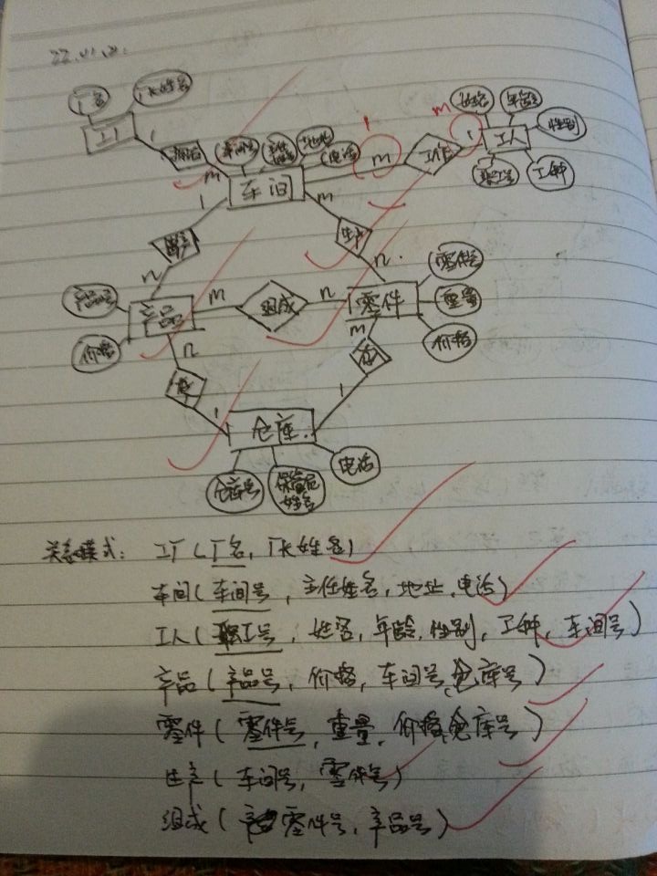
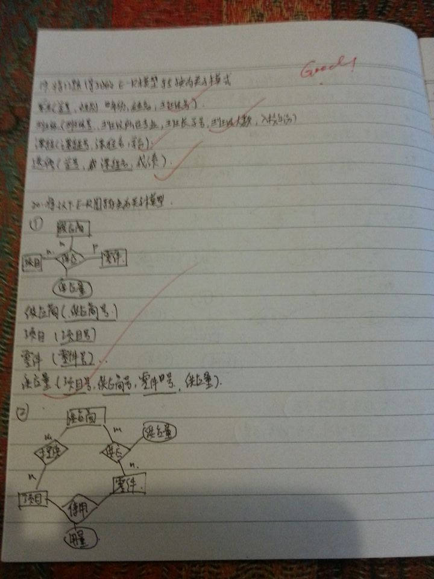
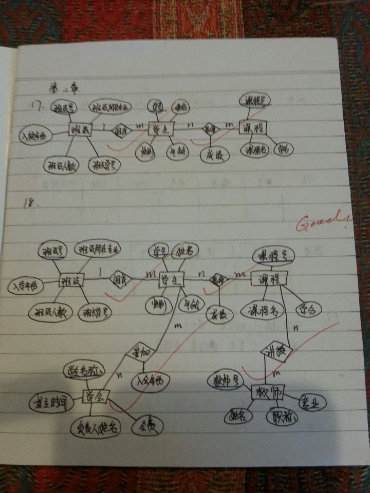
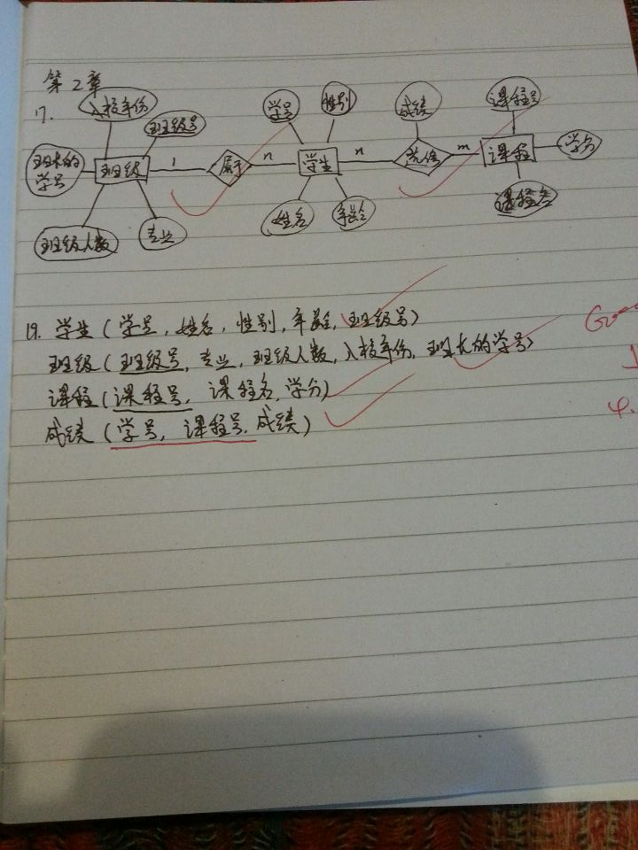
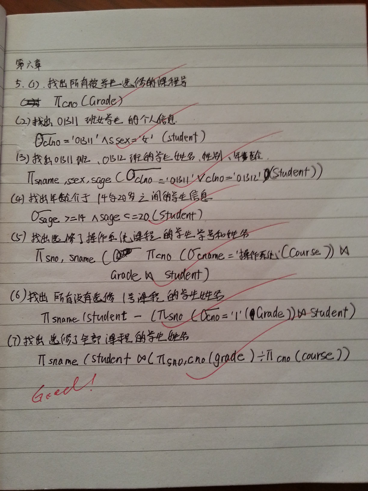
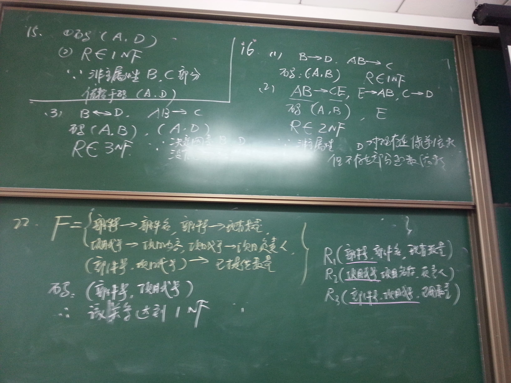
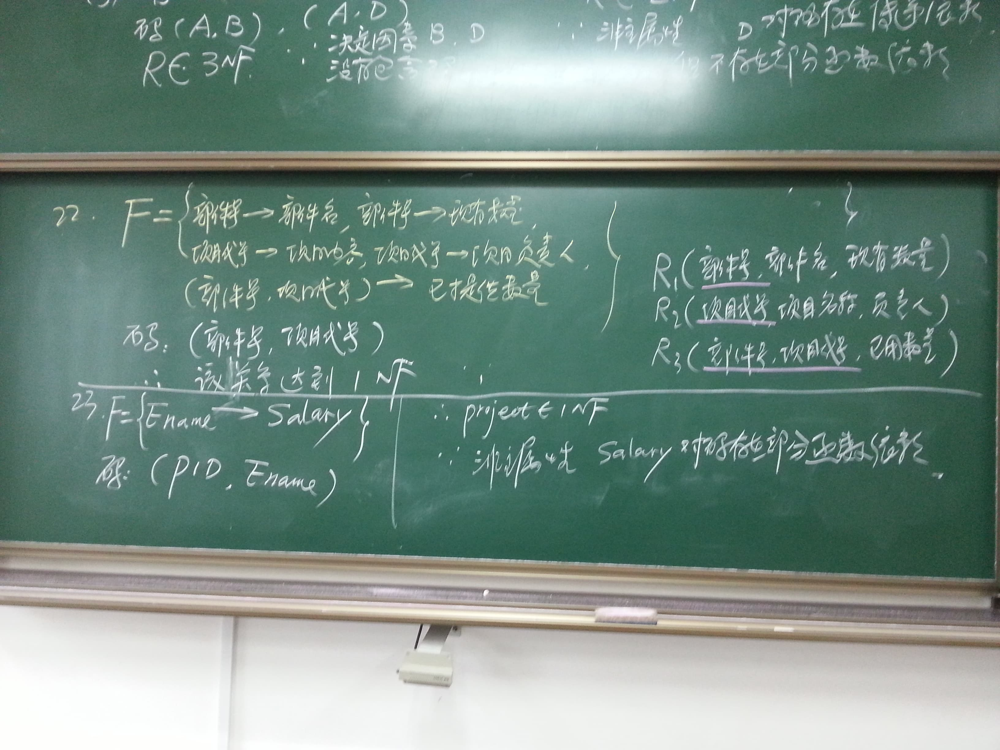
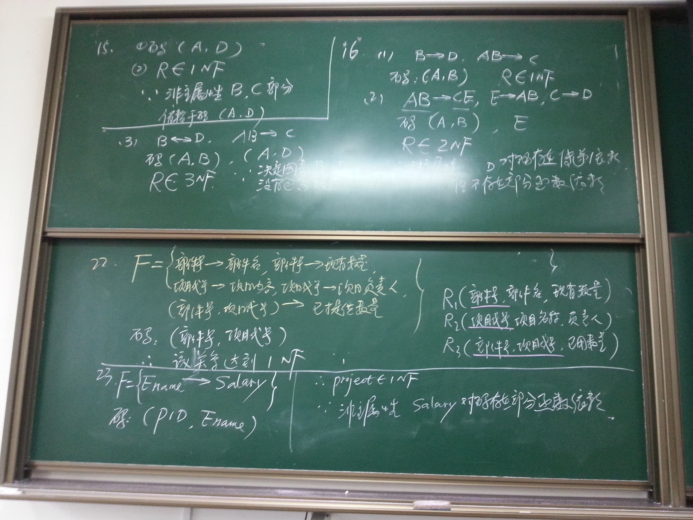

# 课后作业答案

> 18级的解答答案

## [#](https://hziee.site/pages/Y1S2/DatabaseTheory/HomeworkImg.html#第二章作业)第二章作业

- 作业 1

- 作业 2

- 作业 3

- 作业 4

## [#](https://hziee.site/pages/Y1S2/DatabaseTheory/HomeworkImg.html#第六章作业)第六章作业

- 作业 5

## [#](https://hziee.site/pages/Y1S2/DatabaseTheory/HomeworkImg.html#第七章作业)第七章作业

- 作业 2

- 作业 3

- 作业 4

