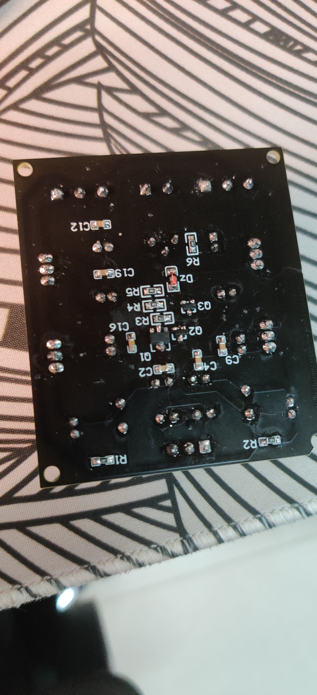
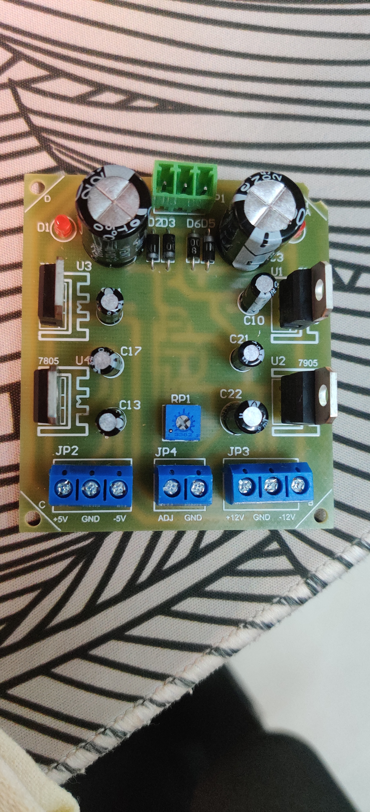
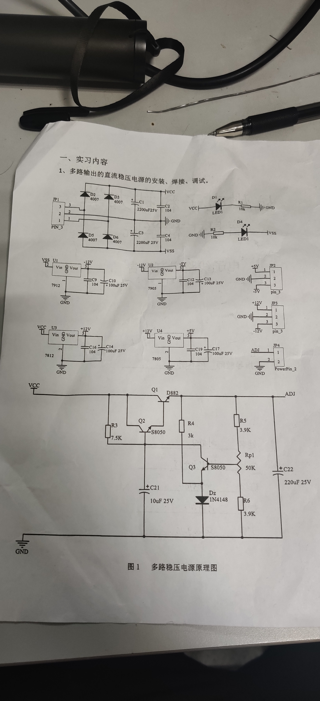

# 电子线路实习课程

::: warning

该课程每一年的内容可能会有变动 请以当年的实际教学内容为主

如下内容仅供参考 非官方标准答案

:::

## 电路板焊接

::: details 成品参考

:::

::: details 电路设计

::: 

## 报告与题目

|               | 理论值(V)     | 测量值(V) | 相对误差(%) |
| ------------- | ------------- | --------- | ----------- |
| Vcc 电压      | $12\sqrt{2}$  | $16.84$   | $0.75$      |
| Vss 电压      | $-12\sqrt{2}$ | $-16.77$  | $1.17$      |
| 7805 输出电压 | $+5$          | $5.07$    | $1.40$      |
| 7905 输出电压 | $-5$          | $-5.09$   | $1.80$      |
| 7812 输出电压 | $+12$         | $12.08$   | $0.67$      |
| 7912 输出电压 | $-12$         | $-12.14$  | $1.17$      |
|               |               |           |             |

### 分析误差产生的原因

- 二极管在电路连通时会分压 而在理论计算中不考虑此分压
- 电源接入处和电流输出处有较大的电阻
- 万用电表测量精度有限 且会有一定的误差
- 滤波电容等电路元件与标值有出入

### 假设发光二极管的管压降为 $2V$ 试计算多路稳压电源中指示电路的工作电流为多少

$$
\begin{aligned}
Known : V_{cc} &= 12\sqrt{2} \\
U_{D_{1}} &= 2V \\
\therefore U_{R_1} &= V_{cc} - V_{D_1} = (12\sqrt{2} - 2) V \\
\therefore I_1 &= \frac{U_{R_1}}{R_1} \approx 1.47 \times 10^{-3} A
\end{aligned}
$$

另外一个$Vss$ 电路也同理

### 请说明可调电源电路中接入的各元器件的作用 并简述稳压的工作流程

- $R_4$
  - 限流电阻
- $Q_1 \enspace Q_2$
  - 三极管用于对电路的变化产生负反馈
  - 使电路的输出电阻趋于 0 电压可调且稳定
  - 双三极管使得负反馈更加精细
- $C_{21} \enspace C_{22}$
  - 滤波电容
  - 降低输出电压的波动
- $R_{p1}$
  - 阻值可调的电阻
- $D_z$
  - 稳压二极管
  - 使电路的基准稳压平稳
- $R_5 \enspace R_6$
  - 采样电阻
  - 将变化的电压获取一部分
- $R_3$
  - 与$D_z$ 组成基准稳压部分
  - 提供稳定的基准稳压

工作过程 :

> 出于某些原因（电源电压波动或负载电阻的变化等）使输出电压升高（或降低）由$R_{p1} \enspace R_5 \enspace R_6$ 组成的采样电路获取一部分改变的电压$U_F$ 送到 $Q_3$ 的基级
>
> 由 $D_Z$ 与$R_4$ 组成 向$Q_3$ 提供稳定的基准电压 $U_z$
>
> 由$Q_3$ 进行 $U_F$ 与 $U_z$ 的差值比较并放大到 $Q_2$ 的基极
>
> 由 $Q_2 \enspace Q_1$  对电压的改变做出负反馈调整

### 如何改变可调电源的下限电压

$$
\begin{aligned}
\frac{u_0}{U_1} &= \frac{R_5 + R_{p1}+R_6} {R_6 + R_{p} \rq } \\
\Rightarrow \qquad U_1 &= \frac{U_0 \cdot (R_6 + R_{p} \rq)}{R_5 + R_{p1}+R_6}
\end{aligned}
$$

由公式可得 : **减小 $R_{p1} \rq$** 的值即可